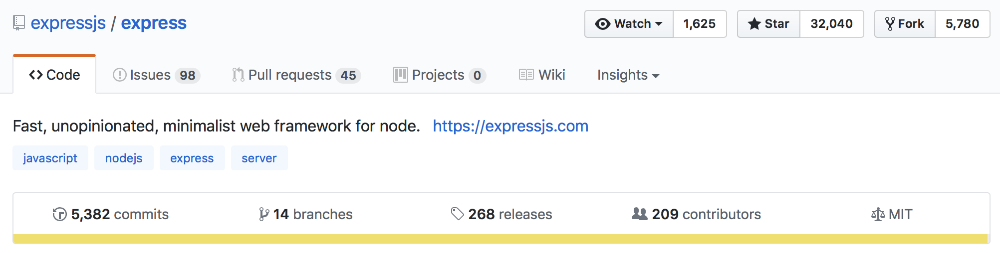
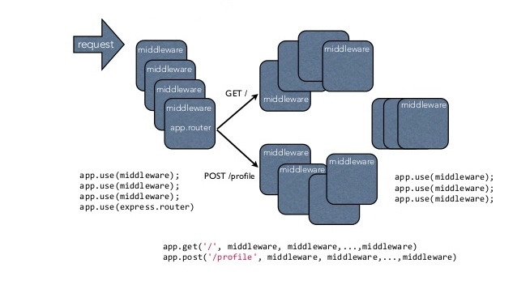
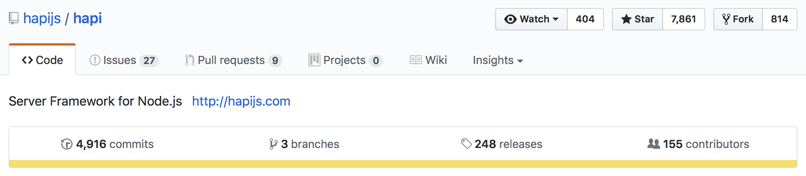

<div class="logo" style="margin-bottom:40px;">

</div>

## Node.js Web Frameworks

---

<div class="logo">

</div>

Florent Suc

`@florentsuc`

---

### Introduction

- Développeur mobile hybride freelance :
    - Cordova
    - Ionic (Angular)
- Développeur backend :
    - Projets client complets
    - Side projects

---

### Pourquoi utiliser un framework web node.js ?


+++

- Investir du temps dans la *tâche*, pas dans la *technologie*
- Suivre de *bonnes pratiques* (structure, sécurité)
- Support & communauté

Note:
- Votre problématique a peu de chances d'être nouvelle
- Ne pas réinventer la roue (tâches génériques déjà implémentées et testées)
- Notre objectif : avoir un framework qui nous laisse beaucoup de possibilités

---

### Quelles sont les fonctionnalités qu’on attend d’un framework web ?

- Routage
- Moteur de template
- Gestion des erreurs
- Gestion des environnements
- Cache, Authentification, etc.

---

### Routage

- Définition des endpoints de l'application (URL + Méthode)
- Définition de la manière dont ils répondent aux requêtes clients

Note:
Réponse: vue / JSON / erreur 404 / etc.

+++

### Routage — Sans Framework

````typescript
export const server = http.createServer((req: http.IncomingMessage, res: http.ServerResponse) => {
    if (req.url === "/") {
        fs.readFile("./dist/views/talks.html", "utf8", (error: any, content: string) => {
            // ...
            res.writeHead(200, { "Content-Type": "text/html" });
            res.end(content, "utf-8");
        });
    } else if (req.url === "/add-talk") {
        if (req.method === "GET") {
            // ...
        } else if (req.method === "POST") {
            // ...
        }
    } else {
        fs.readFile("./dist/views/404.html", "utf8", (error: any, content: string) => {
            res.writeHead(200, { "Content-Type": "text/html" });
            res.end(content, "utf-8");
        });
    }
});
````
@[2]
@[8]
@[9-13]
@[14]

Note:
- Très vite compliqué à gérer si plusieurs routes
- Récupération des paramètres pas simple (regex)
- Différenciation des méthodes et url entrainant des if/else en masse
- Vite, une lib de routage !!!

---

### Moteur de Template

- Lier les données issues du backend aux vues HTML
- Construire des modules et layouts HTML réutilisables
- Ajouter des conditions et itérations / boucles basiques aux vues HTML

Exemple : Pug (Jade), Handlebars, Hogan, EJS, etc.

Note:

+++

### Moteur de Template — Sans Framework

````typescript
let talksTpl = "";
talks.forEach(talk => {
    talksTpl += `<li>${talk.author}</a> sent ${talk.subject}</li>`;
});
content = content.replace("{talks}", talksTpl);
````
@[1]
@[2]
@[3]
@[5]

````html
<div class="proposals">
    <ul>{talks}</ul>
</div>
````

Note:
Limites :

- pas scalable
- pas de if/else
- pas d'itérations, de modules, etc.

---

### Gestion d'erreur

- Gérer les erreurs de route
- Gérer les erreurs applicatives
- Valider des données

Note:
- Validation données (formulaires, POST API par exemple)

---

### Autres fonctionnalités

- Gestion d'environnement (dev, prod)
- Debug / Logging
- Cache
- Authentification & Authorization

Note:
- Différencier les environnements pour activer / désactiver certaines features

---

### Démo

---

### Rappel de nos besoins

- Objectif pédagogique
- Créer un projet complet :
    - Authentification
    - CRUD
    - API
    - etc.

Note:
Objectif pédagogique :

- comparer les outils, les implémentations
- aborder tous les aspects d'un "vrai projet"

---

### Les différents framework web

Les plus populaires parmi les "less opinionated" :

- Express
- Hapi

Note:
- Less opinionated = moins dogmatique (qui ne nous bloque pas dans la manière de faire les choses comme la structure) => Rappel de notre objectif
- Il en existe un paquet d'autres (Feathers, Meteor, SailsJS (express), Restify (API), ...)
- Chaque framework a son utilité (Temps réel, Fullstack, Data oriented, ...)

---

### Express

`Fast, unopinionated, minimalist web framework for node.`



- Le plus populaire (32k stars)
- Open Source — Licence MIT

+++

### Express — Historique

- **Novembre 2010** : Première release par *TJ Holowaychuk*
- **Juin 2014** : Racheté par StrongLoop
- **Septembre 2015** : StrongLoop est racheté par IBM
- **Janvier 2016** : IBM donne le projet à la Node.js Foundation
- **Aujourd'hui** : Release stable v4.15.3

+++

### Express — Introduction

- Minimal et flexible
- Base de nombreux frameworks (Feathers, KeystoneJS, Sails, etc.)
- Set robuste de fonctionnalités pour des applications web, mobiles et API
- Projet mature, avec une énorme communauté

Note:
- Exemple Flexible: Express ne fait aucune supposition en terme de structure (fichiers, répertoires)

+++

### Express — Les middlewares

**Une application Express n’est ni plus ni moins qu’une succession d’appels de fonctions middleware**

Une fonction middleware peut :

- Exécuter du code
- Apporter des modifications aux objets req & res
- Appeler le prochain middleware
- Terminer le cycle

+++

````typescript
var app = express();

app.use((req, res, next) => {
  next();
});

app.get('/', (req, res, next) => {
    console.log('Request Type: ', req.method);
    next();
});
````
@[1]
@[3-5]
@[7-10]

Note:
2 méthodes pour lier un middleware à l'app : use et METHOD (HTTP)

+++



Note: 
Compression / Sass / Morgan (logging) / CookieParser / Passport / etc.

+++

### Express — Routeur 

````typescript
const express = require('express');
const app = express();

app.get('/', (req, res) => { });

app.post('/talks', (req, res) => { 
    res.render('talk', { name: req.body.name });
});

app.del('/talks/:id', (req, res) => {
    res.send('REMOVED TALK ' + req.params.id)
 });

app.get('*', (req, res) => { // 404 });

app.listen(3000);
````
@[4]
@[6-8]
@[10-12]
@[14]

Note:
- Gestion routage pour API, Affichage d'une vue
- Demo d'un passage de paramètre

+++

### Express — Moteur de template

````typescript
const app = express();

app.set('views', __dirname + '/views');
app.set('view engine', 'pug');

app.get('/', (req, res) => { 
    res.render( 'index.pug', { title: 'Talks', talks: talks } );
});
````
@[3]
@[4]
@[6-8]

````
.proposals
    h1= title
    if talks
        ul
            each talk in talks
                li= talk.title
    else
        p No talk :-(
````
---

## Hapi



- Plus récent qu'Express
- Assez populaire (8k stars)
- Licence : BSD-3-Clause

Note:
28 issues ouvertes seulement / 2399 closed
5 pr ouvert / 1078 closed

+++

### Hapi — Historique

- **Août 2011** : Premier commit par *Eran Hammer* (ancien membre de WalmartLabs)
- **Aujourd'hui** : Dernière release stable v16.2

Note:
Eran Hammer (Créateur OAuth 1.0)

+++

### Hapi — Introduction

- Plus de configuration — Moins de code
- Intégration de plus de fonctionnalités de base (Authentification & Authorization)
- Conçu pour des équipes & projets plus importants
- Couverture de code à 100% sur les modules
- Testé chez Walmart lors du Black Friday (et utilisé par Disney & Macy's)

Note:
- Histoire du black friday : Créé par la Mobile Team de Walmart pour gérer le trafic ecommerce de leur boutique

+++

### Hapi — Routeur

````typescript
const Hapi = require('hapi');
const server = new Hapi.Server(3000);

server.route({
    method: ['POST', 'PUT'],
    path: '/talks',
    handler: (request, reply) => {
        reply({
            talk: {
                title: request.payload.title,
                author: request.payload.author
            }
        });
    },
    config: {
        validate: {
            payload: {
                title: Joi.string().min(10).required(),
                author: Joi.string().required()
            }
        }
    }
});

server.start(() => {
    console.log('Server running at: ' + server.info.uri);
});
````
@[1-2]
@[5]
@[6]
@[7-14]
@[15-22]
@[25-27]

Note:
- Hapi: orienté configuration (single object)
    - Methode HTTP : 1 ou plusieurs pour une même réponse (handler)
    - Path
    - Handler (que doit faire l'application ?) : reply + accès au Payload
    - Config : ici validation du payload avec Joi (Object schema description language and validator for JavaScript objects par HapiJs)
- Plus verbeux, mais au final très explicite (plus facile dans une grosse équipe)

+++

### Hapi — Plugins

- Étendre l'application par des plugins existants
- Découper l'application en modules isolés et réutilisables

Note:
- Equivalent des middlewares sur Express
- Plugins existants nombreux
- Idéal pour le travail en équipe importante

+++

### Hapi — Utilisation d'un plugin

````typescript
server.register({
    register: require('hapi-assets'),
    options: {
        development: {
            js: ['js/one.js', 'js/two.js'],
        },
        production: {
            js: ['js/scripts.js'],
        }
    }
});
````
@[1]
@[2]
@[3-10]

````
each item in assets.js
    script(src='#{item}')
````

Note:
- Utilisation de la méthode register()
- Possibilité de découper ses routes, ses composants métiers, etc.

+++

### Hapi — Moteur de template

````typescript
const Path = require('path');
const Hapi = require('hapi');
const server = new Hapi.Server();

server.register(require('vision'), (err) => {
    server.views({
        engines: {
            pug: require('pug')
        },
        path: __dirname + '/templates',
    });
});
````
@[5]
@[6]
@[7-9]
@[10]

Note:
- Vision: Ajoute la fonctionnalité de  template rendering à Hapi. (plugin : register)
- Pug: On register le module pug comme le moteur responsable du rendu des fichiers pug

---

### Différences fondamentales entre les frameworks

*Express*

- Orienté "code"
- Très léger
- Destiné à de petites à moyennes applications 
- Fonctionne dans un grand nombre de situations
- Utilise des Middlewares

+++

*Hapi*

- Orienté "configuration"
- Destiné à de plus gros projets / équipes
- Intègre nativement plus de fonctionnalités
- Utilise des Plugins
- Conçu autour des tests / sécurité

Note:
On ne parle pas de perfomances

---

### À vous de choisir — Questions

