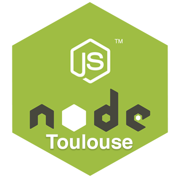

---?image=assets/nodejs-toulouse-bg.png

---

# <i class="fa fa-twitter"></i> @nodejs_toulouse

---

### Meetup Node.js à Toulouse ?

- Bonne ambiance !
- Sujets variés
- Partage de connaissances
- VOUS ! |

---

### Et après...


---
<div class="logo" style="margin-bottom:40px;">

</div>

## Introduction à Node.js

Note:
- Théorie
- Un peu de pratique...
- Les choses à savoir pour débuter

---


<br /> 
Julien MARTIN
<br /> 
`@mrtnjln`


---

### Genèse de Node.js (1/2)


Note:
- Barre de progression sur Flickr en 2008
- Upload non bloquant avec feedback du serveur

---

### Genèse de Node.js (2/2)

#### Objectif : serveur web non bloquant

- Mongrel : serveur HTTP en Ruby  |
- Plusieurs tentatives : C, Python... |
- 2009 : 1ère démo à JSConf.eu |

Note:
- (Mongrel) Possibilité d'inclure un serveur HTTP comme librairie applicative
- (Mongrel) Simplicité de fonctionnement : recevoir une requête HTTP et décider soi-même de la réponse à apporter
- 1ère démo : serveur IRC en 400 lignes de code JS !

---

### Vision de Ryan Dahl

- Un seul thread : ordonnant l'exécution via une boucle d'événement |
- Applications web moderne : utilisation intensive des E/S |
- Flux de programme : dirigé par des rappels asynchrones |
- Programmes complexes : assemblés à partir de programmes plus simples |

<h4 class="fragment">Vous êtes perdus… ? <i class="fa fa-frown-o"></i></h4>

---

### Définition de Node.js

>Node.js® is a JavaScript runtime built on Chrome's V8 JavaScript engine. Node.js uses an event-driven, non-blocking I/O model that makes it lightweight and efficient. Node.js' package ecosystem, npm, is the largest ecosystem of open source libraries in the world.

Note:
- Node.js est une plate-forme de programmation JavaScript !

---

### ECMAScript (1/2)


---

### ECMAScript (2/2)


--- 

### Moteur V8

 

- Moteur JavaScript open source par Google
- V8 est écrit en C++
- Utilisé dans le navigateur Chromium

Note:
- parser, compiler et exécuter JavaScript
- Impact direct pour Node.js : nouveautés d'ECMAScript

---

### JavaScript, dans sa “globalité”

JavaScript peut être découpé en 3 parties :
- Le langage en lui-même (éléments de langage, mots clés, concepts...) |
- Le moteur de script sur lequel il peut tourner : (V8 par exemple !) |
- Les APIs : |
    - Dans un navigateur : Navigator, Window, Document... |
    - Dans Node.js : filesystem, events, http, net, stream... |

---

### Code bloquant


---

### Code non bloquant


---

### C'est la grande force de Node.js

#### Merci C++ !

 

---

### Node.js : vue générale (1/3)


Note:
- Code intéragit avec V8

---

### Node.js : vue générale (2/3)


Note:
- Couche polyglotte

---

### Node.js : vue générale (3/3)


Démo : [Latent Flip](http://latentflip.com/loupe/)

Note:
- (LibUV) : Async I/O, Event loop, Thread pool
- La commande est passé au caissier, une à une (call stack!)
- Après avoir commandé, vous attendez.
- Derrière, les équipiers travaillent sur votre commande (callbacks!)
- Et déposent les produits sur l'étagère quand c'est prêt (task queue!)
- La nourriture est récupérée par le caissier (event loop!)

---

### Callback pattern

````javascript
const fs = require('fs');

fs.readFile('stuff.txt', 'utf8', function (err, data) {
    if (err) return console.log(err);
    console.log(data);   
}
````

@[1]
@[3]

---

### Callback hell

````javascript
getData(function(a) {
    getMoreData(a, function(b) {
        getMoreData(b, function(c) {
            getMoreData(c, function(d) {
                getMoreData(d, function(e) {
                    ...                
                });            
            });
        });    
    });
});
````

---

### Des fonctions nommées...

````javascript
const fs = require('fs');

const file = 'stuff.txt';

fs.readFile(file, 'utf8', function appendText(err, data) {
    if (err) return console.log(err);    
    data += 'Appended something!';    

    fs.writeFile(file, data, function notifyUser(err) {
        if (err) return console.log(err);        
        console.log('Appended text!');    
    });
});
````

@[5]
@[9]

---

### Déclarer ses fonctions avant...

````javascript
const fs = require('fs');

function notifyUser(err) {
    if (err) return console.log(err);        
    console.log('Appended text!');    
};

function appendText(err, data) {
    if (err) return console.log(err);    
    data += 'Appended something!';    

    fs.writeFile(file, data, notifyUser)
};

fs.readFile('stuff.txt', 'utf8', appendText);
````

@[3]
@[8]
@[15]
@[12]

---

### Async.js (1/2)


---

### Async.js (2/2)

````javascript
const fs = require('fs');  
const async = require('async');

const file = 'stuff.txt';

async.waterfall([
    (callback) => { 
        fs.readFile(file, 'utf8', callback);    
    },    
    (data, callback) => {        
        data += 'Appended something!';        
        fs.writeFile(file, data, callback);    
    }],
    (err, result) => {    
        if (err) return console.log(err);    
    });
````

@[2]
@[6]
@[7-13]
@[14-16]

---

### Bluebird (1/2)


---

### Bluebird (2/2)

````javascript
const Promise = require('bluebird');  
const fs = Promise.promisifyAll(require('fs'));

const file = 'stuff.txt';  

fs.readFileAsync(file, 'utf8')
    .then((data) => {      
        data += 'Appended something!';    
        fs.writeFile(file, data);
    })
    .then(() => {    
        console.log('Appended text!');
    })
    .catch((err) => {    
        console.log(err);
    });
````

@[1]
@[2]
@[6-13]
@[14-16]

---

### Promises ?

````javascript
// Promise maison !
const fs = require('fs'); 

fs.readFileAsync = (filename) => {
    return new Promise((resolve, reject) => {
        fs.readFile(filename, (err, data) => {
            if (err) {
                reject(err);
            } else {
                resolve(data);
            }
        });
    });
};
`````

@[2]
@[4]
@[5]
@[8]
@[10]

---

### Async / Await (1/2)

````javascript
const async = require('asyncawait/async');
const await = require('asyncawait/await');
const Promise = require('bluebird');
const fs = Promise.promisifyAll(require('fs'));
 
const file = 'stuff.txt';  
 
(async function() {
    try {
        let data = await fs.readFileAsync(file, 'utf-8');
        data += 'Appended something!';
        await fs.writeFileAsync(file, data);
    }
    catch(err) {
        console.log(err);
    }
})();
````

@[1-2]
@[3]
@[4]
@[8-17]

---

### Async / Await (2/2)

````javascript
// Node 8 !
const fs = require('fs');
const promisify = require('util').promisify;
const readFileAsync = promisify(fs.readFile);
const writeFileAsync = promisify(fs.writeFile);

const file = 'stuff.txt';  

(async function() {
    try {
        let data = await readFileAsync(file, 'utf-8');
        data += 'Appended something!';
        await writeFileAsync(file, data);
    }
    catch(err) {
        console.log(err);
    }
})();
````

@[2]
@[3]
@[4-5]
@[9-18]

---

### Comparaison

<table style="text-align:center; font-size: 30px;">
  <tr>
    <th></th>
    <th>Code non bloquant (boucle d'événement)</th> 
    <th>Clarté du code (data-flow and error-flow)</th>
  </tr>
  <tr>
    <td>Code synchrone</td>
    <td><i class="fa fa-frown-o" style="color:red"></i></td>
    <td><i class="fa fa-smile-o" style="color:green"></i></td>
  </tr>
  <tr class="fragment">
    <td>Callbacks</td>
    <td><i class="fa fa-smile-o" style="color:green"></i></td>
    <td><i class="fa fa-frown-o" style="color:red"></i></td>
  </tr>
  <tr class="fragment">
    <td>Callbacks + control-flow (async.js)</td>
    <td><i class="fa fa-smile-o" style="color:green"></i></td>
    <td><i class="fa fa-frown-o" style="color:red"></i></td>
  </tr>
  <tr class="fragment">
    <td>Promises + control-flow (bluebird)</td>
    <td><i class="fa fa-smile-o" style="color:green"></i></td>
    <td><i class="fa fa-frown-o" style="color:red"></i></td>
  </tr>
  <tr class="fragment">
    <td>Async/Await</td>
    <td><i class="fa fa-smile-o" style="color:green"></i></td>
    <td>
        <i class="fa fa-smile-o" style="color:green"></i>
        <i class="fa fa-frown-o" style="color:red"></i></td>
  </tr>
</table>

---

### Modularité

- Utilisation de `require('module')` pour importer d’autres fichiers JS

 

Note:
- Require : d'abord dans ses fichiers, puis `node_modules` (resolve, loading, wrapping, evaluating, caching)
- NPM : outil en ligne de commande, un registre de modules ainsi qu’une entreprise privée !
- NPM : 475 000 modules !
- NPM : par défaut avec Node.js depuis Novembre 2011

---

### Le “fail” de left-pad 

11 petites lignes de code...

 

---

### Vision de Ryan Dahl

- Un seul thread : ordonnant l'exécution via une boucle d'événement |
- Applications web moderne : utilisation intensive des E/S |
- Flux de programme : dirigé par des rappels asynchrones |
- Programmes complexes : assemblés à partir de programmes plus simples |

<h4 class="fragment">Vous êtes des pros ! <i class="fa fa-smile-o"></i></h4>

---

### Quand utiliser Node.js ?

- Applications temps réel (chats, dashboard...) |
- Applications ayant de nombreuses actions concurrentes |
- Utilisation de JSON en natif |
- Votre équipe maîtrise JS ! |

Note:
- 1) Gros flux de données
- 2) Beaucoup de requêtes avec accès réseau/fichier/système
- 3) BD NoSQL par exemple !
- 4) Unifier les équipes front/back

---

### Quand ne pas utiliser Node.js ?

- Votre solution marche déjà bien ! |
- CMS :o |
- Utilisation du CPU trop intensive |
- JS ne vous convient pas |

Note:
- 3) Gestion fine de la mémoire, plusieurs CPU
- 4) Opérations mathématiques de très haute précision (python), bien que le norme soit comme C#, JAVA...

---

### Qui utilise Node.js ?

- Paypal |
- LinkedIn |
- Yahoo, Mozilla |
- Netflix, Uber, Ebay... |

Note:
- 1) Drop JAVA. App plus rapide à dev. avec moins de ressources (33% de lignes et 40% de fichiers en moins)
- 2) Drop RoR. App 20x plus rapide avec moins de ressources serveurs (de 30 à 3 serveurs)
- 3) Dev unifié ! Des fronts font du back !

---

### Versionning


Note:
- Semver : MAJEUR.MINEUR.CORRECTIF 
- Deux versions majeurs par an, 1 LTS (dix-huit mois LTS, puis 12 en maintenance)
---

### Écosystème


<h4 class="fragment">= Node.js Foundation</h4>

Note:
- Joyent fondé en 2004. Toujours propriètaire de la marque et du logo
- io.js : Fork de Node : gestion de la plate-forme transparente, inclusive et ouverte et v8 à jour
- Node.js Foundation (fait partie de Linux Foundation) récupère la gestion de Node en Février 2015
- Comité Technique : première tache fusion de Node et io.js en v4 (Septembre 2015)
---

### Node 8 : What's new ?

- NPM 5 |
- Moteur V8 (5.8) |
- N-API |
- Debugging facilité |
- util.promisify() |

Note:
- V8 5.8 : Ignition & TurboFan  

---

### Node.green


Note:
- Matrice de compatibilité entre une version de Node et ECMAScript

---

### Node Security Platform


Note:
- Auditer la sécurité de tous les modules npm
- Communiquer les failles auprès des auteurs de modules
- Permettre à quiconque de savoir si un module donné dépend de module vulnérable

---

### NodeBots


Note:
- NodeBots : Communauté de créateur de Robots avec Node.js
- Johnny-Five : compatible avec Arduinos, Raspberry Pis & plus pour manipuler des joysticks, led, moteurs...

---

### Commencer Node.js... en 2017 !

- Apprendre les rouages de JavaScript ! |
- Commencer par une petite application et s'entraîner avec les modules de base |
- Parcourir Node.cool ! |
- Embrasser TypeScript et toute la puissance de JS ! |
- Venir à Node.js Toulouse ! |

Note:
- Doc officielle : https://nodejs.org/docs/
- TypeScript : https://www.typescriptlang.org/ 

---

# Merci !

### Questions ?